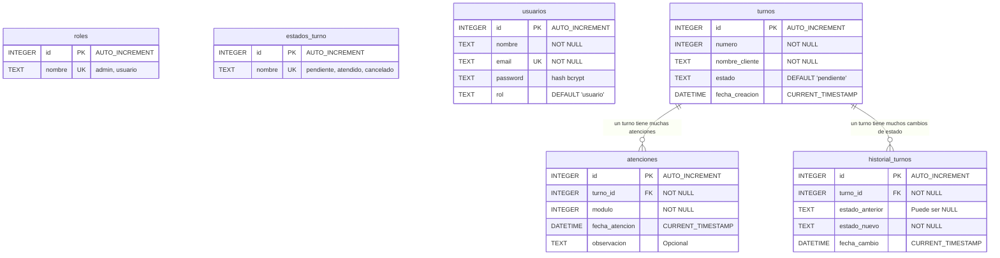
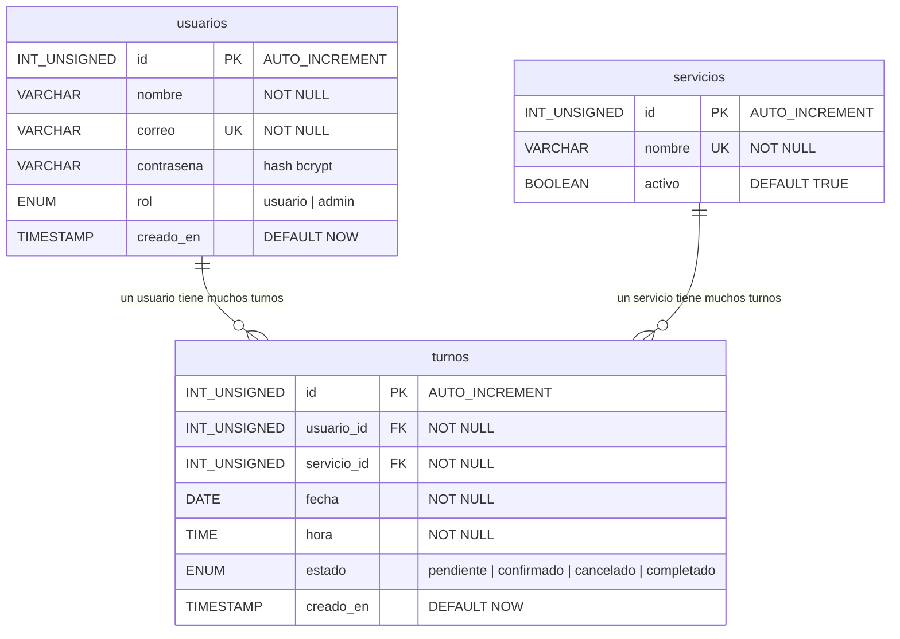
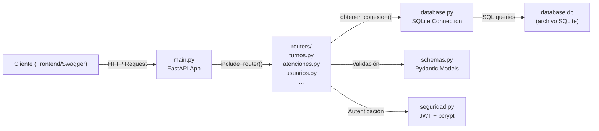
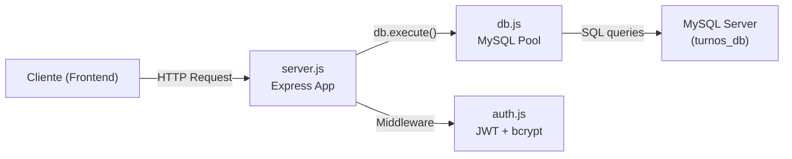
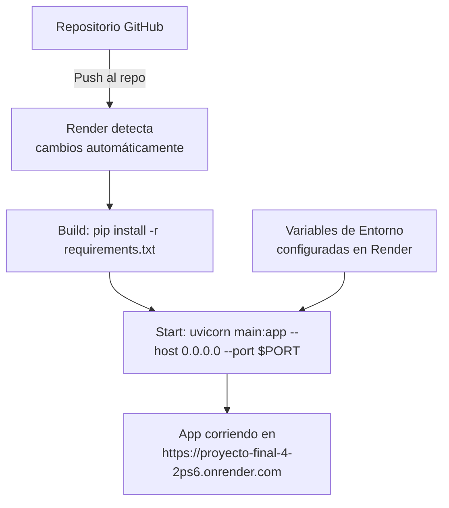
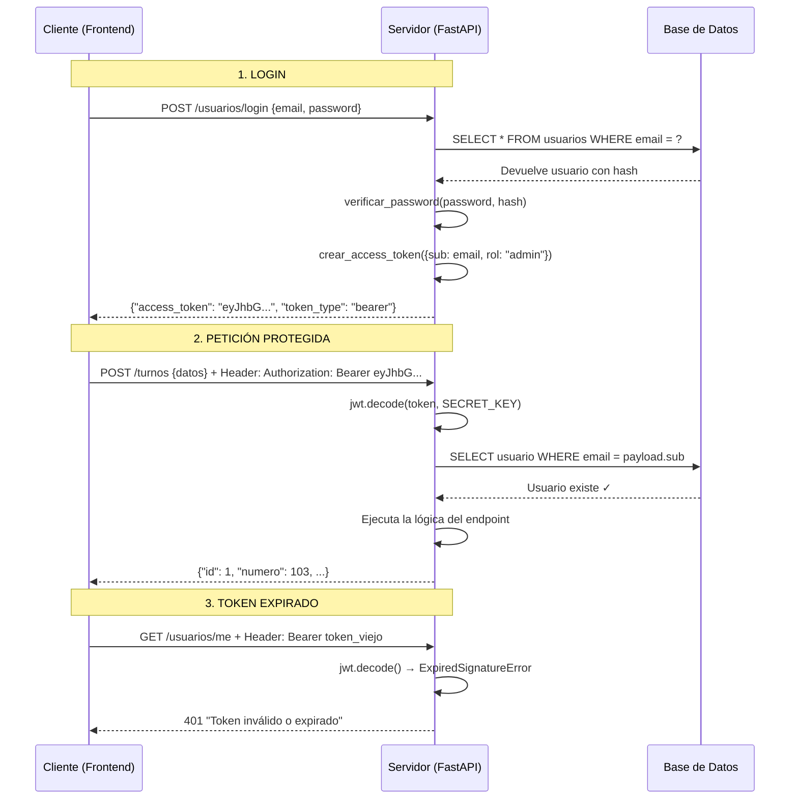
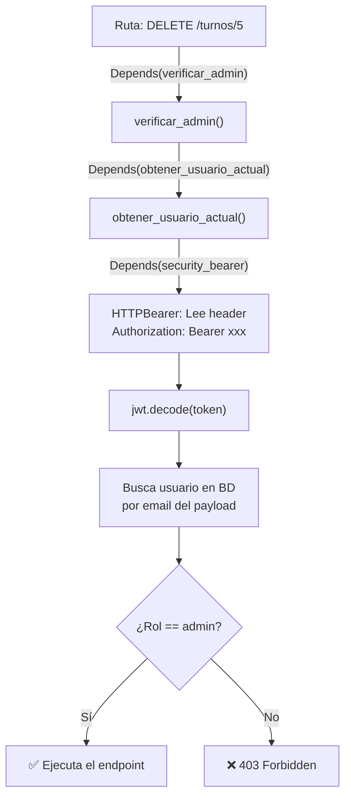
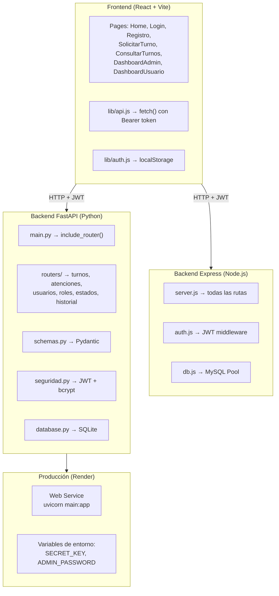

# Sustentación del Proyecto — Sistema de Gestión de Turnos

---

## 1. Modelo Entidad-Relación (E-R)

El proyecto tiene **dos backends** con modelos ligeramente distintos:

### 1.1 Backend FastAPI (SQLite) — 6 tablas



> [!IMPORTANT]
> Las tablas `roles` y `estados_turno` son **catálogos independientes** (no tienen FK directa a las otras tablas en la definición actual). Sirven como referencia para los valores válidos. La tabla `usuarios` también es **independiente** de `turnos` (no hay FK `usuario_id` en `turnos`).

### 1.2 Backend Node.js/Express (MySQL) — 3 tablas



### Diferencias clave entre ambos modelos

| Aspecto | FastAPI (SQLite) | Express (MySQL) |
|---|---|---|
| Relación usuario-turno | No existe (independientes) | `usuario_id` FK en `turnos` |
| Tabla de servicios | No existe | `servicios` como catálogo |
| Tabla de atenciones | Sí (registro de módulo que atiende) | No existe |
| Historial de estados | `historial_turnos` | No existe |
| Catálogos | `roles`, `estados_turno` | Inline con `ENUM` |

---

## 2. ¿Cómo se conecta la Base de Datos con las Rutas?

La conexión sigue un **flujo en 3 capas**. Así funciona en cada backend:

### 2.1 Backend FastAPI (Python + SQLite)



**Paso a paso:**

1. **Conexión a BD** — En [database.py](file:///c:/Users/Jhostyn/proyecto_final/backend_fastapi/database.py#L8-L12):
   ```python
   def obtener_conexion():
       connection = sqlite3.connect(DATABASE, check_same_thread=False)
       connection.row_factory = sqlite3.Row   # Las filas se acceden como diccionarios
       connection.execute("PRAGMA foreign_keys = ON")  # Activa FK en SQLite
       return connection
   ```

2. **Registro de rutas** — En [main.py](file:///c:/Users/Jhostyn/proyecto_final/backend_fastapi/main.py#L37-L42), cada router se monta con `app.include_router()`:
   ```python
   app.include_router(turnos.router)          # → /turnos
   app.include_router(atenciones.router)       # → /atenciones
   app.include_router(usuarios.router, prefix="/usuarios")  # → /usuarios
   app.include_router(roles.router)            # → /roles
   app.include_router(estados_turno.router)    # → /estados-turno
   app.include_router(historial_turnos.router) # → /historial-turnos
   ```

3. **Dentro de cada ruta** — Ejemplo en [turnos.py](file:///c:/Users/Jhostyn/proyecto_final/backend_fastapi/routers/turnos.py#L38-L60):
   ```python
   @router.get("", response_model=list[TurnoResponse])
   def listar_turnos():
       conexion = obtener_conexion()      # 1. Abre conexión
       cursor = conexion.cursor()          # 2. Crea cursor
       cursor.execute("SELECT * FROM turnos")  # 3. Ejecuta SQL
       turnos = cursor.fetchall()          # 4. Obtiene resultados
       conexion.close()                    # 5. Cierra conexión
       return [dict(t) for t in turnos]    # 6. Retorna como JSON
   ```

4. **Validación con Pydantic** — [schemas.py](file:///c:/Users/Jhostyn/proyecto_final/backend_fastapi/schemas.py) define los modelos de entrada/salida:
   - `TurnoCreate` → valida datos al **crear/editar**
   - `TurnoResponse` → formatea la **respuesta** JSON
   - `AtencionCreate` / `AtencionResponse` → lo mismo para atenciones

### 2.2 Backend Express (Node.js + MySQL)



**Paso a paso:**

1. **Pool de conexiones** — En [db.js](file:///c:/Users/Jhostyn/proyecto_final/backend/src/db.js#L4-L13):
   ```javascript
   export const db = mysql.createPool({
       host: process.env.DB_HOST,
       user: process.env.DB_USER,
       password: process.env.DB_PASSWORD,
       database: process.env.DB_NAME,
       connectionLimit: 10
   });
   ```

2. **Rutas directas en server.js** — En [server.js](file:///c:/Users/Jhostyn/proyecto_final/backend/src/server.js) todas las rutas están en un solo archivo, usando `db.execute()` directamente:
   ```javascript
   app.get('/api/turnos', autenticar, async (req, res) => {
       const [turnos] = await db.execute(`SELECT ... FROM turnos t JOIN servicios s ...`, [req.usuario.id]);
       res.json(turnos);
   });
   ```

---

## 3. ¿Cómo se desplegó en Render?

El backend FastAPI está desplegado en: **https://proyecto-final-4-2ps6.onrender.com**

### 3.1 Proceso de despliegue



### 3.2 Configuración en Render

| Configuración | Valor |
|---|---|
| **Tipo de servicio** | Web Service (capa gratuita) |
| **Repositorio** | Conectado a GitHub |
| **Build Command** | `pip install -r requirements.txt` |
| **Start Command** | `uvicorn main:app --host 0.0.0.0 --port $PORT` |
| **Runtime** | Python 3 |

### 3.3 Variables de entorno en Render

Se configuran desde el **Dashboard de Render → Environment**:

| Variable | Descripción |
|---|---|
| `SECRET_KEY` | Clave secreta para firmar tokens JWT |
| `ADMIN_PASSWORD` | Contraseña del admin sembrado al inicio |
| `USER_PASSWORD` | Contraseña del usuario normal sembrado al inicio |

> [!WARNING]
> **Limitaciones de la capa gratuita de Render:**
> 1. **Arranque en frío (Spin down):** La instancia se suspende tras ~15 minutos de inactividad. La primera petición puede tardar ~1 minuto.
> 2. **Almacenamiento efímero:** SQLite vive en el sistema de archivos del contenedor. Cada vez que se reinicia o despliega, **los datos se pierden** y se re-siembran con `sembrar_datos()`.

### 3.4 ¿Cómo funciona el arranque en producción?

Según [main.py](file:///c:/Users/Jhostyn/proyecto_final/backend_fastapi/main.py#L30-L33):

```python
@app.on_event("startup")
def al_iniciar():
    crear_tablas()     # Crea las 6 tablas si no existen
    sembrar_datos()    # Inserta roles, estados, usuarios y turnos de ejemplo
```

Esto garantiza que cada vez que Render reinicia el servidor, la base de datos se reconstruye automáticamente con datos de prueba.

---

## 4. JWT (JSON Web Token) — ¿Cómo funciona en el proyecto?

### 4.1 ¿Qué es JWT?

JWT es un estándar para transmitir información de autenticación de forma segura entre el cliente y el servidor. El token es una cadena codificada que contiene la identidad del usuario y una firma digital.

### 4.2 Flujo completo de autenticación



### 4.3 Implementación en el código

#### Crear el token — [seguridad.py](file:///c:/Users/Jhostyn/proyecto_final/backend_fastapi/seguridad.py#L41-L51)

```python
def crear_access_token(datos: dict) -> str:
    datos_a_codificar = datos.copy()
    expiracion = datetime.now(timezone.utc) + timedelta(minutes=60)  # Expira en 60 min
    datos_a_codificar.update({"exp": expiracion})
    token_jwt = jwt.encode(datos_a_codificar, SECRET_KEY, algorithm="HS256")
    return token_jwt
```

**Contenido del token (payload):**
```json
{
  "sub": "admin@correo.com",
  "rol": "admin",
  "exp": 1726488347
}
```

#### Verificar el token — [seguridad.py](file:///c:/Users/Jhostyn/proyecto_final/backend_fastapi/seguridad.py#L55-L86)

```python
def obtener_usuario_actual(credentials = Depends(security_bearer)):
    token = credentials.credentials
    payload = jwt.decode(token, SECRET_KEY, algorithms=["HS256"])
    email = payload.get("sub")
    # Busca el usuario en la BD para confirmar que aún existe
    cursor.execute("SELECT id, nombre, email, rol FROM usuarios WHERE email = ?", (email,))
    usuario = cursor.fetchone()
    return dict(usuario)
```

#### Verificar rol Admin — [seguridad.py](file:///c:/Users/Jhostyn/proyecto_final/backend_fastapi/seguridad.py#L90-L98)

```python
def verificar_admin(usuario_actual = Depends(obtener_usuario_actual)):
    if usuario_actual.get("rol") != "admin":
        raise HTTPException(status_code=403, detail="Requiere ROL admin")
    return usuario_actual
```

### 4.4 ¿Dónde se usa JWT en las rutas?

| Nivel de protección | Dependencia usada | Ejemplo de ruta |
|---|---|---|
| **Público** (sin token) | Ninguna | `GET /turnos`, `GET /atenciones` |
| **Usuario autenticado** | `Depends(obtener_usuario_actual)` | `POST /turnos`, `PUT /turnos/{id}` |
| **Solo administrador** | `Depends(verificar_admin)` | `DELETE /turnos/{id}`, `DELETE /usuarios/{id}` |

### 4.5 Cadena de dependencias (cómo se conecta todo)



### 4.6 Seguridad de contraseñas

Las contraseñas **nunca se guardan en texto plano**. Se usa **bcrypt** via `passlib`:

```python
# Encriptar al registrar
pwd_context.hash("mi_password")  → "$2b$12$xK3j..."

# Verificar al hacer login  
pwd_context.verify("mi_password", "$2b$12$xK3j...")  → True/False
```

### 4.7 Preguntas frecuentes de sustentación sobre JWT

> **¿Por qué JWT y no sesiones?**  
> JWT es **stateless**: el servidor no guarda nada en memoria. Toda la información del usuario viaja dentro del token. Esto es ideal para APIs REST que pueden escalarse horizontalmente.

> **¿Qué pasa si alguien roba el token?**  
> El token expira en 60 minutos (`ACCESS_TOKEN_EXPIRE_MINUTES = 60`). Además, se valida contra la BD (si el usuario fue eliminado, el token deja de funcionar aunque no haya expirado).

> **¿Qué algoritmo se usa?**  
> `HS256` (HMAC con SHA-256). Es simétrico: la misma `SECRET_KEY` firma y verifica.

> **¿Dónde se guarda el SECRET_KEY?**  
> En **variables de entorno** (archivo `.env` local, o configuración de Render en producción). Nunca se hardcodea en el código. Si no está definida, la app **no arranca** intencionalmente.

---

## 5. Resumen de Arquitectura Completa


